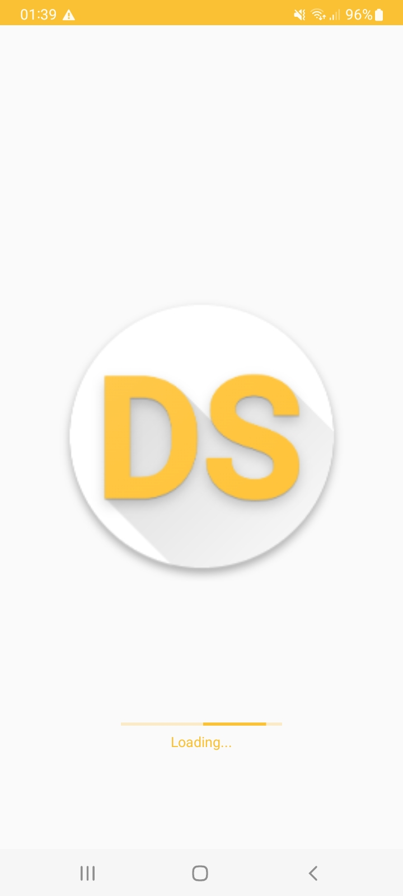
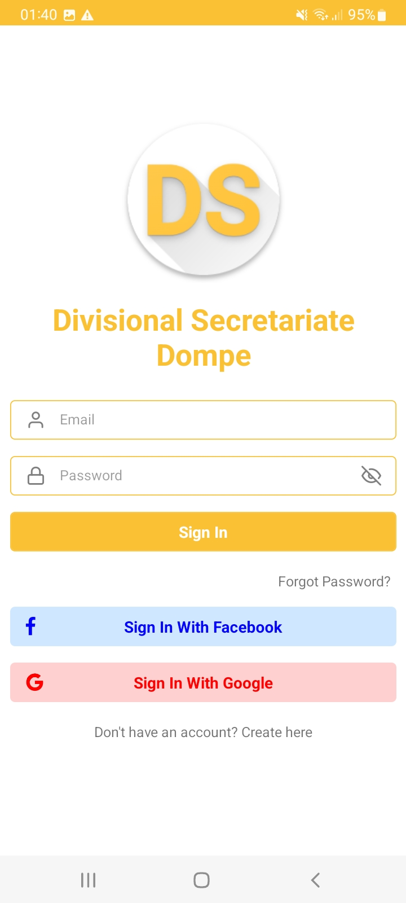
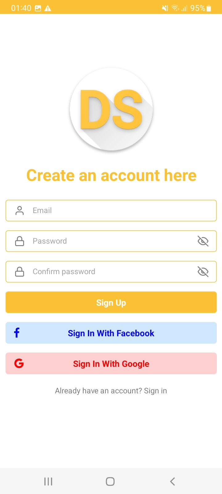
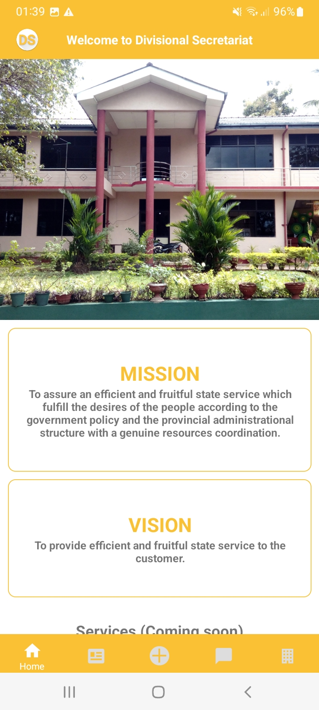
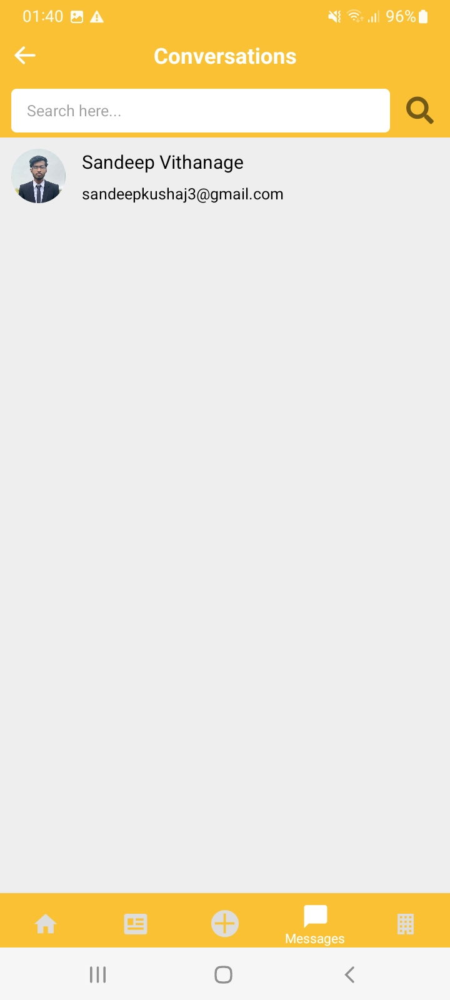
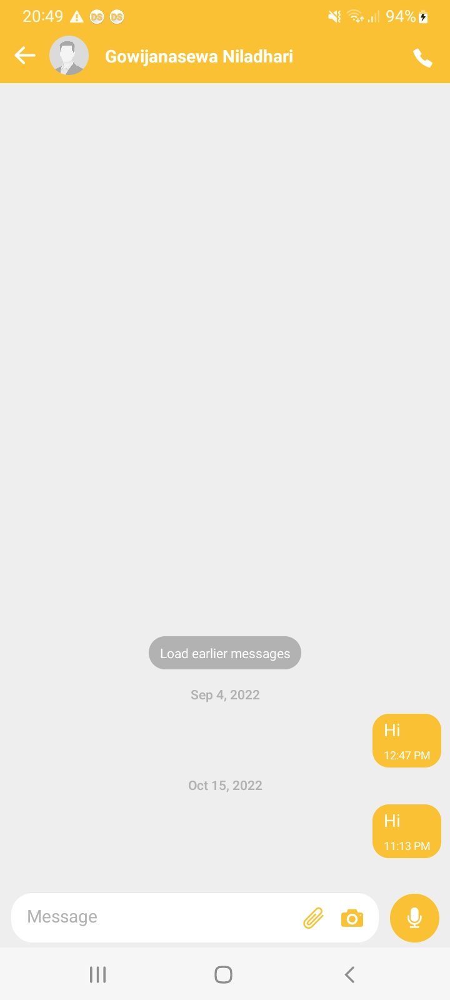
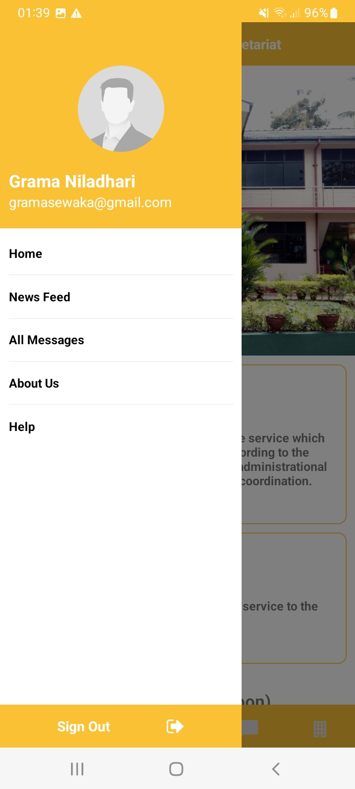
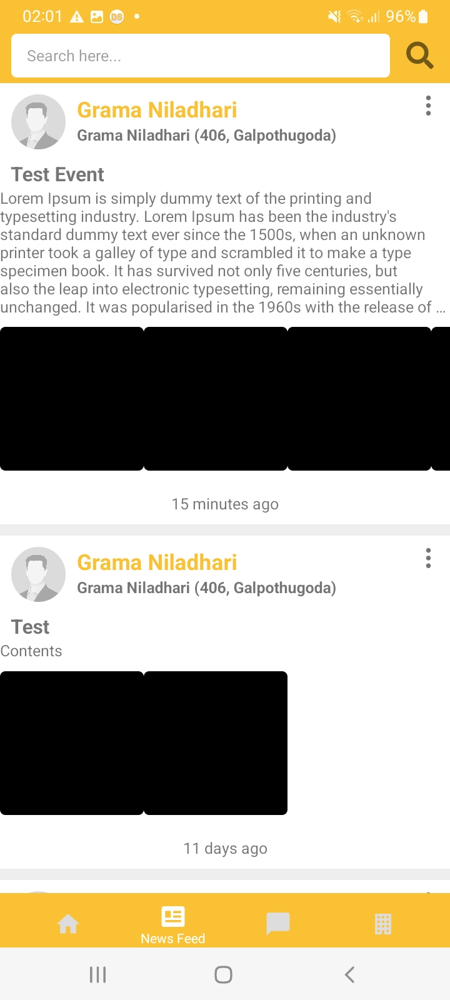
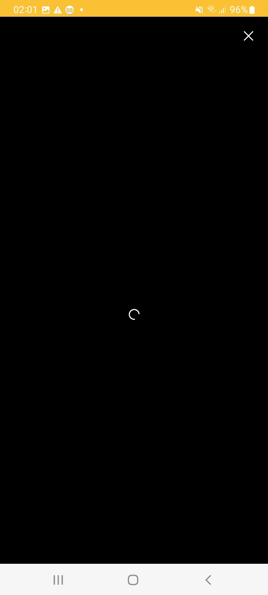

# Divisional Secretariate Mobile App

A mobile app and a admin app to introduce a new concept for the future of Sri Lanka which is rich in information and communication technology field. This project is for the people to contact with officers in divisional secretariat in their area, such as Gramasewaka, and get information and notifications from them.

## Description

This app is a React Native mobile app for the people to contact with officers in divisional secretariat in their area, such as Gramasewaka, and get information and notifications from them.

## Getting Started

### Dependencies

- For backend
  - @react-native-async-storage/async-storage@^1.17.3
  - @react-native-community/progress-bar-android@^1.0.4
  - @react-native-firebase/app@^14.8.0
  - @react-native-firebase/auth@^14.8.0
  - @react-native-firebase/firestore@^14.7.0
  - @react-native-firebase/messaging@^14.8.0
  - @react-native-google-signin/google-signin@^7.2.2
  - @react-navigation/drawer@^6.3.1
  - @react-navigation/material-bottom-tabs@^6.1.1
  - @react-navigation/native@^6.0.8
  - @react-navigation/native-stack@^6.5.0
  - @react-navigation/stack@^6.1.1
  - add@^2.0.6
  - axios@^0.21.0
  - moment@^2.29.4
  - react@17.0.2
  - react-devtools@^4.24.4
  - react-devtools-core@^4.24.4
  - react-native@0.67.4
  - react-native-app-intro-slider@^4.0.4
  - react-native-auto-height-image@^3.2.4
  - react-native-autoheight-webview@^1.6.1
  - react-native-fbsdk-next@^7.3.3
  - react-native-file-picker@^0.0.21
  - react-native-file-viewer@^2.1.5
  - react-native-gesture-handler@^2.3.2
  - react-native-gifted-chat@^0.16.3
  - react-native-image-crop-picker@^0.37.3
  - react-native-image-picker@^4.7.3
  - react-native-image-viewing@^0.2.2
  - react-native-linear-gradient@^2.5.6
  - react-native-paper@^4.11.2
  - react-native-pell-rich-editor@^1.8.8
  - react-native-push-notification@^8.1.1
  - react-native-radial-gradient@^1.0.9
  - react-native-reanimated@^2.4.1
  - react-native-responsive-screen@^1.4.2
  - react-native-safe-area-context@^4.2.1
  - react-native-screens@^3.13.1
  - react-native-vector-icons@^9.1.0
  - react-native-video@^5.2.0
  - react-native-video-player@^0.12.0
  - react-native-webview@^11.18.1
  - react-redux@^7.2.6
  - redux@^4.1.2
  - rn-searchable-picker@^1.0.2
  - socket.io-client@^4.4.1"

### Installing

- [Setup environment](https://reactnative.dev/docs/environment-setup)
- Clone the project

  ```
  git clone https://github.com/SandeepKushajVithanage/DivisionalSecretariatMobileApp.git

  cd DivisionalSecretariatMobileApp
  ```

- Installing the dependancies (from project root directory)
  - ```
      yarn install
    ```

### Executing program

- To build the app (from project root directory)
  ```
    yarn android
  ```
- To run the metro bundle (from project root directory)
  ```
    yarn start
  ```

## Authors

- [SandeepKushajVithanage (sandeepkushaj3@gmail.com)](https://github.com/SandeepKushajVithanage)

## Version History

- 1.0.0
  - Initial Release for testing

## Screenshots











